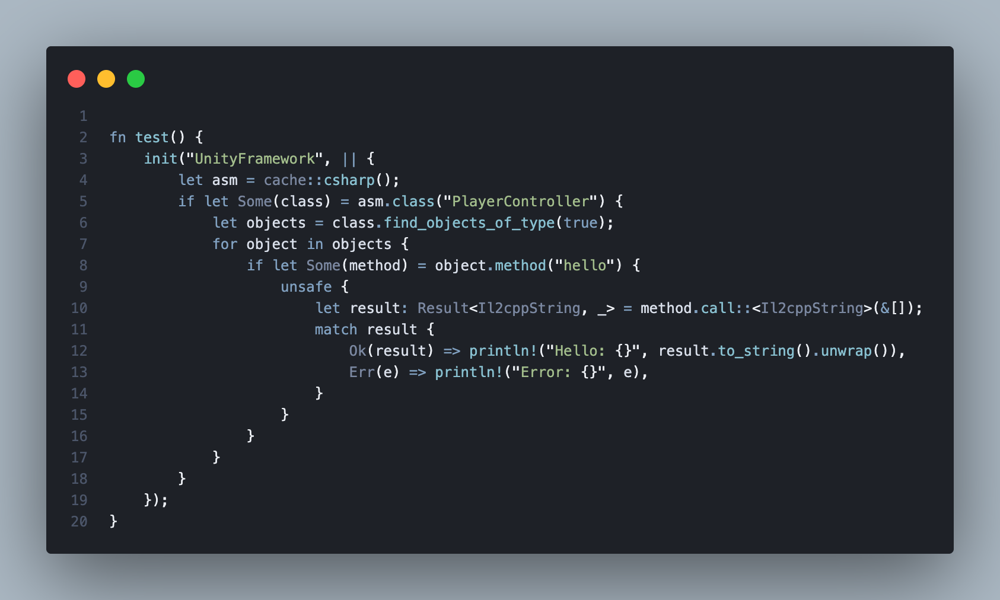

# il2cpp-bridge-rs

<a href="LICENSE"></a>
<a href="https://www.rust-lang.org"></a>
<a href="#platform-support"></a>

A high-performance Rust bridge to Unity's IL2CPP runtime. It resolves IL2CPP's exported C functions at runtime and wraps them in a safe, ergonomic API — letting you query types, invoke methods, and manipulate Unity objects directly from native code.



### Why Rust?

Built in Rust for maximum performance: zero-cost C FFI means no overhead on every IL2CPP call, no garbage collector or runtime competing with Unity's, and compile-time memory safety around the raw pointer operations that IL2CPP introspection demands. The result is a library that's as fast as hand-written C but significantly harder to misuse.

## Features

- **Full IL2CPP introspection** — resolve assemblies, classes, methods, fields, and properties by name at runtime
- **Type-safe method invocation** — call any IL2CPP method with argument validation, return type unboxing, and automatic managed exception handling
- **Concurrent caching** — `DashMap`-backed cache for fast, thread-safe lookups across assemblies and types
- **Unity type wrappers** — ready-to-use wrappers for `GameObject`, `Transform`, `Camera`, `Vector3`, `Quaternion`, and more
- **Metadata dumping** — export full class/method metadata to files for offline analysis
- **Cross-platform** — macOS/iOS, Linux/Android, Windows with platform-specific symbol resolution

## Quick Start

```bash
cargo add il2cpp-bridge-rs
```

The source code is well-structured and the best way to understand the full API — dig into `src/structs/` for type wrappers, `src/api/` for runtime bindings and caching, and `src/api/wrappers/` for real-world usage patterns.

## Building

A `Makefile` is provided for convenience. Each platform has `build-*`, `build-*-release`, `check-*`, and `clippy-*` targets:

| Platform | Build | Release | Check | Clippy |
|----------|-------|---------|-------|--------|
| Host | `make build` | `make build-release` | `make check` | `make clippy` |
| iOS | `make build-ios` | `make build-ios-release` | `make check-ios` | `make clippy-ios` |
| macOS | `make build-macos` | `make build-macos-release` | `make check-macos` | `make clippy-macos` |
| Linux | `make build-linux` | `make build-linux-release` | `make check-linux` | `make clippy-linux` |
| Android | `make build-android` | `make build-android-release` | `make check-android` | `make clippy-android` |
| Windows | `make build-windows` | `make build-windows-release` | `make check-windows` | `make clippy-windows` |

Utilities: `make doc` (generate and open docs), `make clean` (clean build artifacts).

## Platform Support

| Platform | Target | Symbol Resolution | Image Base |
|----------|--------|-------------------|------------|
| macOS/iOS | `aarch64-apple-ios` | `dlsym` | `dyld` |
| Linux/Android | `aarch64-linux-android` | `dlsym` | `dl_iterate_phdr` |
| Windows | `x86_64-pc-windows-msvc` | `GetProcAddress` | `GetModuleHandleA` |

## Documentation

See the [`docs/`](docs/) directory:

- [Getting Started](docs/getting-started.md)
- [Architecture](docs/architecture.md)
- [API Reference](docs/api-reference.md)
- [Platform Support](docs/platform-support.md)

## Issues

Found a bug or running into an error? [Open an issue](https://github.com/Batchhh/il2cpp-bridge-rs/issues/new/choose) — we have templates to help you provide the right details.

## Contributing

Contributions are welcome! See [CONTRIBUTING.md](CONTRIBUTING.md) for guidelines on reporting issues, submitting pull requests, and development setup.

## License

[MIT](LICENSE)
